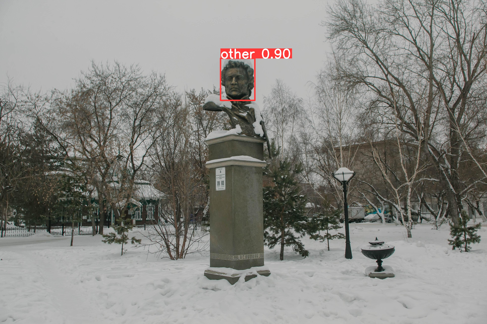
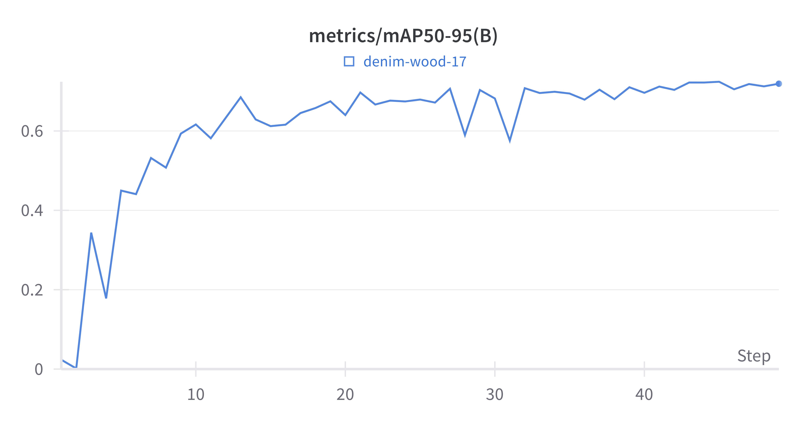
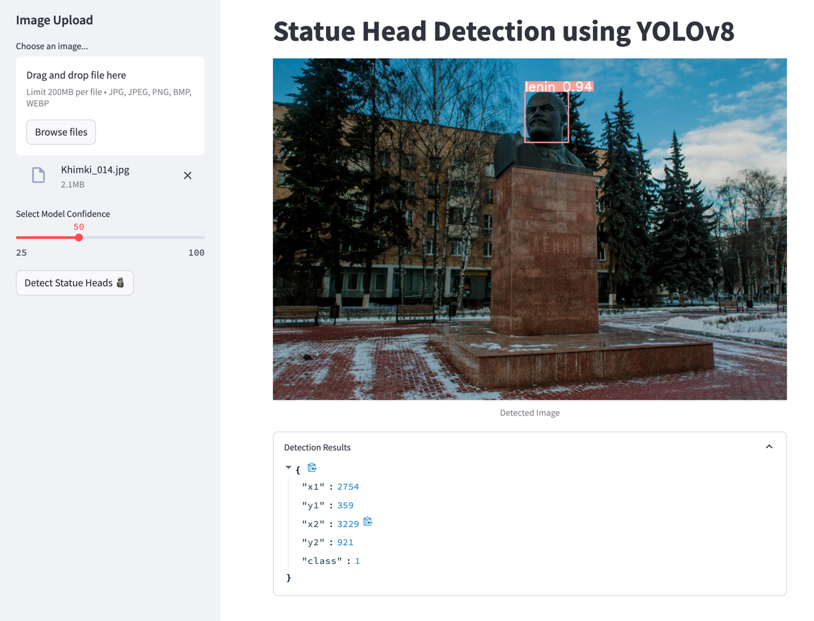

# Statue Head Detection using YOLOv8 🗿

This repo consists of a deep learning solution for detecting the heads of statues in images and classifying them as either Vladimir Lenin, Mustafa Kemal Ataturk, or others.

## Structure of the Repository

The repository is organized into several directories and files, each serving a specific purpose in the project workflow:

### Configuration and Setup

- `.env-example`: Provides an example structure for an `.env` file that you should create to manage environment variables securely.
- `.gitignore`: Lists files and directories that Git should ignore, preventing unnecessary or sensitive files from being tracked and shared.
- `requirements.txt`: Specifies the Python packages required for the project, enabling easy setup with `pip install -r requirements.txt`.

### Source Code and Scripts

- `run_solution.py`: Main script to run the pre-trained model on a set of images. It processes the images through the model and outputs the results in the specified format.
- `train_yolo8.py`: Script for training the YOLO model on the dataset. It includes the training and validation of the model. And tracks the experiments via W&B.
- `prepare_dataset.py`: Automates the data preparation process from the Exploratory Data Analysis (EDA) notebooks. It cleans and formats the dataset, ensuring it is ready for training with YOLOv8.
- `streamlit_demo.py`: Streamlit application script providing an interactive web interface to demonstrate the model's capabilities in real time.

### Model and Configuration

- `model_weights/`: Directory containing pre-trained model weights. These weights can be used for immediate inference or as a starting point for further training.
- `yolo_config/`: Contains configuration files for the YOLO model, specifying model architecture, hyperparameters, and other settings crucial for model training and inference.

### Documentation and Exploration

- `README.md`: Offers a comprehensive guide to the repository, including setup instructions, usage examples, and general project information.
- `notebooks/`: Includes Jupyter notebooks that detail exploratory data analysis and model training. Serves as diaries and not as final code.

### Utilities and Miscellaneous

- `lint.sh`: A simple shell script to lint the project's codebase. Ensuring adherence to coding standards and best practices..


## Getting Started

### Prerequisites

- Python 3.8 or later
- pip package manager

### Installation

1. **Clone the repository**:
```bash
git clone git@git.toptal.com:screening-ops/Jesus-copado.git
cd Jesus-copado
```

2. **Set up a Python virtual environment**:

It's recommended to create a virtual environment to keep dependencies required by the project separate from your global Python environment.

- For **Unix/macOS** systems:
  ```
  python3 -m venv venv
  source venv/bin/activate
  ```

- For **Windows** systems:
  ```
  python -m venv venv
  .\venv\Scripts\activate
  ```

Note: If you're using a different shell (like fish or csh), the activation script's name might differ (like `activate.fish` or `activate.csh`). Refer to the [Python venv documentation](https://docs.python.org/3/library/venv.html) for more details.

3. **Install the required Python packages**:
```bash
pip install -r requirements.txt
```

4. **Set up your `.env` file based on the `.env-example` provided**.
```bash
cp .env-example .env
```

Open the `.env` file and complete the configuration by filling in the necessary secrets. For instance, the API key for Weights & Biases (W&B) needed for experiment tracking.

## Running the Solution

The `run_solution.py` script is designed to run the YOLOv8 model on a set of images, perform object detection, and classify the detected objects as Vladimir Lenin, Mustafa Kemal Ataturk, or others. The results are saved to a CSV file.

### Features

- **Object Detection**: Detects the head of the statue in the image.
- **Classification**: Classifies the detected head as Lenin, Ataturk, or others.
- **Results Export**: Outputs the results in a CSV file with the format `{image name};{x1};{y1};{x2};{y2};{class}`.
- **Image Saving**: Optionally saves a copy of the images with the predicted bounding boxes drawn on them.

### Usage

Run the script from the command line, specifying the necessary parameters:

```bash
python run_solution.py --weights_path <path_to_weights> --image_folder <path_to_images> --conf_threshold <detection_confidence_threshold> [--save_images]
```
- `--weights_path`: Path to the YOLO model weights.
- `--image_folder`: Folder containing the input images.
- `--conf_threshold`: Confidence threshold for detections. Objects detected with confidence below this threshold will be ignored.
- `--save_images`: If this flag is included, the script will save copies of the input images with the detected bounding boxes drawn on them.

### Saving Images with Predictions
When the `--save_images` flag is used, the script will save copies of the input images with the predicted bounding boxes drawn on them. This is useful for visually verifying the performance of the model.

Here's an example of an image processed by the script:



## Training the Model

The `train_yolov8.py` script is designed to train the YOLOv8 model on your dataset with custom configurations. The script also integrates with Weights & Biases (W&B) for experiment tracking, model checkpointing, and performance visualization.

### Dataset Requirements

**Note**: The dataset should be prepared in the YOLO format and placed in the `datasets` directory before running the training script. Ensure your dataset contains the necessary `.txt` annotation files for each image, along with a `.yaml` file specifying the dataset paths and classes.

### Features

- **Custom Configuration**: Allows for training with custom configurations specified in a YAML file.
- **W&B Integration**: Seamlessly integrates with Weights & Biases for experiment tracking, logging training and validation metrics, and storing model checkpoints.
- **Model Validation**: Automatically validates the model after training to assess performance.

### Usage

Run the script from the command line, specifying the necessary parameters:

```bash
python train_yolov8.py --yaml_path <path_to_yaml> --wandb_project_name <project_name> --model_name <model_name> --epochs <num_epochs> --img_size <image_size> --batch_size <batch_size> [--seed <random_seed>]
```

- `--yaml_path`: Path to the YAML configuration file that defines the dataset and other training parameters.
- `--wandb_project_name`: Project name for Weights & Biases. This organizes your runs under this project.
- `--model_name`: Specifies the YOLOv8 model architecture to use (e.g., yolov8s, yolov8m, yolov8l).
- `--epochs`: Number of epochs to train the model.
- `--img_size`: Image size to be used during training. Larger sizes may improve accuracy but require more GPU memory.
- `--batch_size`: Number of images to process in a batch. Adjust based on the available memory.
- `--seed`: Random seed for reproducibility.

### Weights & Biases Integration

This script uses Weights & Biases for experiment tracking and model checkpointing. Before running the script, ensure you have set up your W&B account and have the following ready:

- **W&B API Key**: Set up your W&B API key in the .env file or as an environment variable.
- **W&B Project**: The script will log runs to the specified project name.

After training, you can visit your W&B project dashboard to view the training metrics, compare different runs, and download the best model checkpoints.

### Visualizing Training Progress

Here's an example visualization from Weights & Biases showing the mAP50-95 metric for a training run:



## Preparing the Dataset

The `prepare_dataset.py` script is designed to prepare your dataset for training with the YOLOv8 model. This script ensures that your dataset is in the correct format, with images and their corresponding labels properly aligned and formatted.

### Features

- **Label Adjustment**: Fixes and scales bounding box labels in your dataset to match the dimensions of the corresponding images.
- **Class Correction**: Corrects class naming issues, ensuring consistency across your dataset.
- **File Renaming**: Renames files and updates label data as needed, maintaining the integrity of the dataset.
- **Dataset Splitting**: Splits the dataset into training, validation, and testing sets based on the specified ratios.
- **YOLO Format Conversion**: Converts annotations to the YOLO format, making the dataset ready for training with YOLOv8.

### Usage

Ensure that the `statues-train` directory from the `statues-train-v2.zip` file is located in the `datasets` directory of your project. Run the script from the command line. The script will automatically process the dataset located in the `datasets/statues-train` directory and output the processed data ready for YOLOv8 training.

```bash
python prepare_dataset.py
```

**Note**: While the `prepare_dataset.py` script encapsulates the data processing logic from the EDA notebook for efficiency and reusability, it does not include the insights, visualizations, and detailed comments found in that notebook. The script focuses purely on preparing the data. For a comprehensive understanding of the data, the rationale behind the preprocessing steps, and the visual exploration of the dataset, refer to the EDA notebook.


## Streamlit Demo

The `streamlit_demo.py` script allows you to interact with the trained YOLOv8 model in a user-friendly web interface. You can upload images, adjust model confidence settings, and visualize the model's predictions in real-time.

### Features

- **User-Friendly Interface**: Designed with Streamlit, the interface is intuitive and straightforward, requiring no prior technical knowledge to use.
- **Image Upload**: Easily upload images through the sidebar. The supported formats include JPG, JPEG, PNG, BMP, and WEBP.
- **Model Confidence Adjustment**: Fine-tune the model's confidence threshold using an interactive slider, allowing you to balance between precision and recall.
- **Real-Time Inference**: Upon image upload and with a click of a button, the model performs inference in real-time, displaying the detected heads of statues and their classifications.
- **Results Exploration**: View detailed bounding box coordinates and class IDs for each detected object. An expander provides a collapsible section to explore these details for each detected statue head.

### Running the Streamlit Demo

To launch the Streamlit demo, navigate to your project directory in the terminal and execute the following command:

```bash
streamlit run streamlit_demo.py
```

The web interface should open automatically in your default browser. If not, you can manually open the URL displayed in the terminal.

### Streamlit App in Action

Here's a look at the Streamlit app in action:



## Code Linting

Maintaining a clean and consistent codebase is crucial for readability and manageability, especially for collaborative projects. The `lint.sh` script is a simple yet powerful tool for ensuring that your code adheres to coding standards and best practices.

The script uses two primary tools for linting:

1. **Black**: An uncompromising code formatter that formats your Python code for uniformity.
2. **pycodestyle**: A tool to check your Python code against some of the style conventions in PEP 8.

By running `lint.sh`, you can automatically format your code with `black` and then check for any style issues with `pycodestyle`. This helps to catch potential problems like syntax errors or deviations from the style guide.

### Running the Linter

To lint your codebase, navigate to your project directory in the terminal and execute the following command:

```bash
bash ./lint.sh
```
